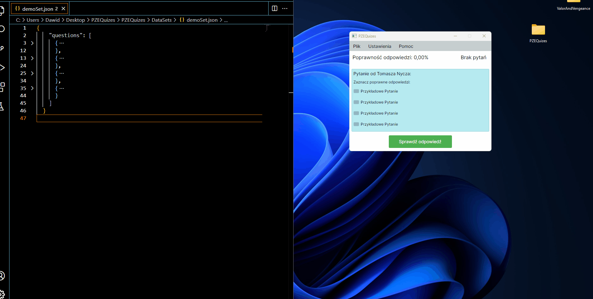

# 📚 Exam Study Application

## 🧠 Project Description

This application is designed to assist users in preparing for exams by utilizing a database of questions stored in JSON format.  
Users can import question sets, answer them, and track their progress.  
The application is built using Avalonia UI, offering a clean and intuitive user interface.

---

## 🤝 Be a Part of the Project

Contribute by adding new datasets, improving existing ones, or reporting issues.  
You can also fork the repository and submit a pull request — every contribution helps us reach our goal!

---

## 🛠️ Technologies Used

- **Programming Language**: C#
- **UI Framework**: Avalonia UI
- **Database Format**: JSON

---

## 📖 How to Use It?

---

## 🚀 Core Features

1. **JSON File Support**  
   - Load and parse question sets from `.json` files

2. **Random Question Order**  
   - Option to shuffle questions for a varied quiz experience

3. **Session Functionality**  
   - Reset progress and restart the question database  
   - View a summary of a completed session

4. **Multiple Question Types**  
   - Single choice (`radio`)  
   - Multiple choice (`checkboxes`)  
   - True/False

5. **Multiple Evaluation Methods**  
   - Wszystko Poprawne  
   - Wszystkie Poprawne  
   - Wszystkie Poprawne (złe zerują)  
   - Inżyniersko

---

## 📂 FYI: Sample Datasets

In the `DataSets` folder, you'll find:
- 📄 A sample file with example questions to help you get started
- 📚 All collected question sets contributed so far

---

## 📄 License

This project is released under the MIT License.
